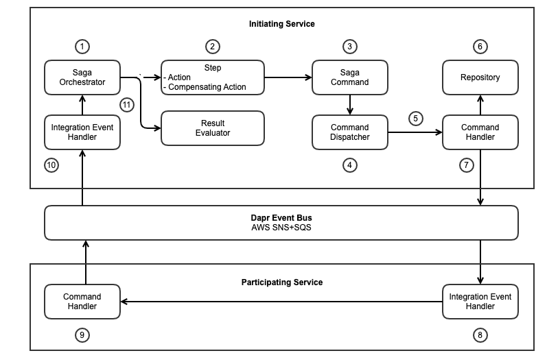

# Saga Development Guide

A development guide for building a saga orchestrator based on **EventDriven.Sagas** abstractions, libraries and reference architecture.

## Introduction

The following diagram illustrates how various classes are used in the execution of a saga.

<p align="center">
  
</p>

## Classes

- **Saga Configuration**: Class the implements `ISagaConfigDefinition`.
  - This class resides in a separate class library and has a `CreateSagaConfig` method that accepts a saga config id and returns a `SagaConfigurationDto` with steps, actions and commands which define the flow of a saga orchestration.
- **Saga**: Class that extends `PersistableSaga`.
  - Resides in the service which initiates the saga.
  - Overrides `ExecuteCurrentActionAsync` and `ExecuteCurrentCompensatingActionAsync` methods to define and dispatch commands.
  - Implement `ISagaCommandResultHandler` to handle reponses from services which publish results to the event bus.
- **Evaluators**: Classes which inherit from `SagaCommandResultEvaluator` and override `EvaluateCommandResultAsync` to determine whether a command result matches its expected result.
- **Commands**: Records which extend `SagaCommand` and contain required data.
- **Dispatchers**: Class responsible for dispatching saga commands.
- **Command Handlers**: Classes which inherit from `ResultDispatchingSagaCommandHandler` and override `HandleCommandAsync` to publish integration events to the event bus.
- **Event Handlers**: Subscribe to event bus topics and implement `ISagaCommandResultDispatcher` to dispatch responses to the **saga** class.

## Steps

### A. Common Project: Integration Models and Events

1. Create a new class library project called **Common**.
   - This will contain classes that are shared between a sagas in the Order Service and other services which participate in the saga.
   - Create an **Integration** folder.
2. Create the following request and response models in an **Integration/Models** folder.
   - For example:
    ```csharp
    public record CustomerCreditReserveResponse(Guid CustomerId, decimal CreditRequested, decimal CreditAvailable, bool Success);
    ```
   - CustomerCreditReserveRequest
   - CustomerCreditReserveResponse
   - CustomerCreditReleaseRequest
   - CustomerCreditReleaseResponse
   - ProductInventoryReserveRequest
   - ProductInventoryReserveResponse
   - ProductInventoryReleaseRequest
   - ProductInventoryReleaseResponse
3. Create the following integration events in an **Integration/Events** folder.
   - For example:
    ```csharp
    public record CustomerCreditReserveFulfilled(CustomerCreditReserveResponse CustomerCreditReserveResponse) : IntegrationEvent;
    ```
   - CustomerCreditReserveRequested
   - CustomerCreditReserveFulfilled
   - CustomerCreditReleaseRequested
   - CustomerCreditReleaseFulfilled
   - ProductInventoryReserveRequested
   - ProductInventoryReserveFulfilled
   - ProductInventoryReleaseRequested
   - ProductInventoryReleaseFulfilled

### B. Order Service: Create Order Saga

1. Create a new Web API project which will contain one or more sagas.
   - Remove WeatherForecast class and controller.
   ```
   dotnet new webapi --name OrderService
   ```
2. Add NuGet packages.
   - MongoDB.Driver
   - URF.Core.Mongo
   - EventDriven.EventBus.Dapr
   - EventDriven.DependencyInjection.URF.Mongo
   - EventDriven.EventBus.Dapr.EventCache.Mongo
   - AutoMapper.Extensions.Microsoft.DependencyInjection
   - EventDriven.Sagas.Abstractions
   - EventDriven.Sagas.DependencyInjection
   - EventDriven.Sagas.Persistence.Mongo
   - EventDriven.Sagas.Configuration.Mongo
3. Add a **Domain** folder.
   - Add an **OrderAggregate** folder to the **Domain** folder.
   - Place `OrderState`, `OrderItem` and `Order` classes in this folder.
4. The `OrderState` enum serves as a semantic lock, which prevents duplicate sagas for a specific order from taking place while the order is in a pending state.
    ```csharp
    public enum OrderState
    {
        Initial,
        Pending,
        Created
    }
    ```
5. Add a **Repositories** folder at the projet root with an `IOrderRepository` interface and a `OrderRepository` class.
   - `OrderRepository` accepts an `IDocumentRepository<Order>` constructor parameter, which is uses to retrieve and persist `Order` entities to MongoDB.
    ```csharp
    public interface IOrderRepository
    {
        Task<Order?> GetAsync(Guid id);
        Task<Order?> AddOAsync(Order entity);
        Task<Order?> UpdateAsync(Order entity);
        Task<Order?> AddUpdateAsync(Order entity);
        Task<int> RemoveAsync(Guid id);
        Task<OrderState?> GetOrderStateAsync(Guid id);
        Task<Order?> UpdateOrderStateAsync(Guid id, OrderState orderState);
    }
    ```
    ```csharp
    public class OrderRepository : DocumentRepository<Order>, IOrderRepository
    {
        public OrderRepository(
            IMongoCollection<Order> collection) : base(collection)
        {
        }

        public async Task<IEnumerable<Order>> GetOrders() =>
            await FindManyAsync();

        public async Task<IEnumerable<Order>> GetCustomerOrders(Guid customerId) =>
            await FindManyAsync(e => e.CustomerId == customerId);

        public async Task<Order?> GetAsync(Guid id) =>
            await FindOneAsync(e => e.Id == id);

        public async Task<Order?> AddOAsync(Order entity)
        {
            var existing = await GetAsync(entity.Id);
            if (existing != null) throw new ConcurrencyException(entity.Id);
            entity.ETag = Guid.NewGuid().ToString();
            return await InsertOneAsync(entity);
        }

        public async Task<Order?> UpdateAsync(Order entity)
        {
            var existing = await GetAsync(entity.Id);
            if (existing == null) return null;
            if (string.Compare(entity.ETag, existing.ETag, StringComparison.OrdinalIgnoreCase) != 0)
                throw new ConcurrencyException(entity.Id);
            entity.ETag = Guid.NewGuid().ToString();
            return await FindOneAndReplaceAsync(e => e.Id == entity.Id, entity);
        }

        public async Task<Order?> AddUpdateAsync(Order entity)
        {
            Order? result;
            var existing = await GetAsync(entity.Id);
            if (existing == null) result = await AddOAsync(entity);
            else
            {
                entity.ETag = existing.ETag;
                result = await UpdateAsync(entity);
            }
            return result;
        }

        public async Task<int> RemoveAsync(Guid id) =>
            await DeleteOneAsync(e => e.Id == id);

        public async Task<OrderState?> GetOrderStateAsync(Guid id)
        {
            var existing = await GetAsync(id);
            return existing?.State;
        }

        public async Task<Order?> UpdateOrderStateAsync(Guid id, OrderState orderState)
        {
            var existing = await GetAsync(id);
            if (existing == null) return null;
            existing.State = orderState;
            return await UpdateAsync(existing);
        }
    }
    ```
6. Add a **Sagas** folder to the project root. Place a **CreateOrder** folder within it.
   - Add a `CreateOrderSaga` class to the **CreateOrder** folder.
   - Derive the class from the `PersistableSaga` abstract class.
   - Override the `CheckLock` method to handle `CheckSagaLockCommand`.
   - Add a ctor that accepts `ISagaCommandDispatcher`, `IEnumerable<ISagaCommandResultEvaluator>`.
   - Override the `ExecuteCurrentActionAsync` method, switching on the action command.
    ```csharp
    protected override async Task ExecuteCurrentActionAsync()
    {
        var action = GetCurrentAction();
        if (Entity is Order order)
        {
            switch (action.Command)
            {
                case Commands.CreateOrder:
                    SetActionStateStarted(action);
                    SetActionCommand(action, order);
                    await SagaCommandDispatcher.DispatchCommandAsync(action.Command, false);
                    break;
                case ReserveCustomerCredit command:
                    command.CustomerId = order.CustomerId;
                    command.CreditRequested = order.Quantity * order.OrderItems.Sum(e => e.ProductPrice);
                    SetActionStateStarted(action);
                    SetActionCommand(action);
                    await SagaCommandDispatcher.DispatchCommandAsync(action.Command, false);
                    break;
                case ReserveProductInventory command:
                    command.InventoryId = order.InventoryId;
                    command.AmountRequested = order.Quantity;
                    SetActionStateStarted(action);
                    SetActionCommand(action);
                    await SagaCommandDispatcher.DispatchCommandAsync(action.Command, false);
                    break;
                case SetOrderStateCreated:
                    SetActionStateStarted(action);
                    SetActionCommand(action, order);
                    await SagaCommandDispatcher.DispatchCommandAsync(action.Command, false);
                    break;
            }
            return;
        }
        await base.ExecuteCurrentActionAsync();
    }
    ```
    - Override `ExecuteCurrentCompensatingActionAsync`.
    ```csharp
    protected override async Task ExecuteCurrentCompensatingActionAsync()
    {
        var action = GetCurrentCompensatingAction();
        if (Entity is Order order)
        {
            switch (action.Command)
            {
                case ReleaseProductInventory command:
                    command.InventoryId = order.InventoryId;
                    command.AmountRequested = order.Quantity;
                    SetActionStateStarted(action);
                    SetActionCommand(action);
                    await SagaCommandDispatcher.DispatchCommandAsync(action.Command, true);
                    break;
                case ReleaseCustomerCredit command:
                    command.CustomerId = order.CustomerId;
                    command.CreditReleased = order.Quantity * order.OrderItems.Sum(e => e.ProductPrice);
                    SetActionStateStarted(action);
                    SetActionCommand(action);
                    await SagaCommandDispatcher.DispatchCommandAsync(action.Command, true);
                    break;
                case SetOrderStateInitial:
                    SetActionStateStarted(action);
                    SetActionCommand(action);
                    await SagaCommandDispatcher.DispatchCommandAsync(action.Command, true);
                    break;
            }
            return;
        }
        await base.ExecuteCurrentCompensatingActionAsync();
    }
    ```
    - Override `ExecuteAfterStep` to call `PersistAsync`.
    - Implement `ISagaCommandResultHandler<OrderState>` to handle the command result. Then do the same for the command result handlers for customer credit.
    ```csharp
    public async Task HandleCommandResultAsync(OrderState result, bool compensating)
    {
        SetCurrentActionCommandResult(result);
        await HandleCommandResultForStepAsync<CreateOrderSaga, OrderState, OrderState>(compensating);
    }
    ```
7. Add a **Commands** folder to the **CreateOrder** folder in **Sagas**.
   - Add records for the following commands. Each command extends `SagaCommand`.
     - CreateOrder
     - GetOrderState
     - ReserveCustomerCredit
     - ReleaseCustomerCredit
     - ReserveProductInventory
     - ReleaseProductInventory
     - SetOrderStateCreated
     - SetOrderStateInitial
8. Add a **Dispatchers** folder to the **CreateOrder** folder in **Sagas**.
   - Create a `CreateOrderSagaCommandDispatcher` class that extends `SagaCommandDispatcher`.
   - Override `DispatchCommandAsync` to dispatch various commands.
    ```csharp
    public class CreateOrderSagaCommandDispatcher : SagaCommandDispatcher
    {
        public CreateOrderSagaCommandDispatcher(IEnumerable<ISagaCommandHandler> sagaCommandHandlers) :
            base(sagaCommandHandlers)
        {
        }

        public override async Task DispatchCommandAsync(SagaCommand command, bool compensating)
        {
            switch (command.GetType().Name)
            {
                case nameof(Commands.CreateOrder):
                    await DispatchSagaCommandHandlerAsync<Commands.CreateOrder>(command);
                    break;
                case nameof(SetOrderStateInitial):
                    await DispatchSagaCommandHandlerAsync<SetOrderStateInitial>(command);
                    break;
                case nameof(ReserveCustomerCredit):
                    await DispatchSagaCommandHandlerAsync<ReserveCustomerCredit>(command);
                    break;
                case nameof(ReleaseCustomerCredit):
                    await DispatchSagaCommandHandlerAsync<ReleaseCustomerCredit>(command);
                    break;
                case nameof(ReserveProductInventory):
                    await DispatchSagaCommandHandlerAsync<ReserveProductInventory>(command);
                    break;
                case nameof(ReleaseProductInventory):
                    await DispatchSagaCommandHandlerAsync<ReleaseProductInventory>(command);
                    break;
                case nameof(SetOrderStateCreated):
                    await DispatchSagaCommandHandlerAsync<SetOrderStateCreated>(command);
                    break;
            }
        }
    }
    ```
9. Add a **Handlers** folder to the **CreateOrder** folder in **Sagas**.
   - Add classes for the following:
     - CheckSagaLockCommandHandler
     - CreateOrderCommandHandler
     - ReserveCustomerCreditCommandHandler
     - ReleaseCustomerCreditCommandHandler
     - ReserveProductInventoryCommandHandler
     - ReleaseProductInventoryCommandHandler
     - SetOrderStateCreatedCommandHandler
     - SetOrderStateInitialCommandHandler
10. Add a **Evaluators** folder to the **CreateOrder** folder in **Sagas**.
    - Add classes for the following:
      - ReserveCustomerCreditResultEvaluator
      - ReleaseCustomerCreditResultEvaluator
      - ReserveProductInventoryResultEvaluator
      - ReleaseProductInventoryResultEvaluator
      - SetOrderStateResultEvaluator
11. Add a **Commands** folder to the **OrderAggregate** folder.
    - Add a `StartCreateOrderSaga` record.
        ```csharp
        public record StartCreateOrderSaga(Order Entity) : Command<Order>(Entity);
        ```
    - Place a `StartCreateOrderSagaCommandHandler` class in a **Handlers** folder under **Commands**.
    - Implement `ICommandHandler<Order, StartCreateOrderSaga>`.
    - Inject `IOrderRepository`, `CreateOrderSaga` into the constructor.
    - In the `Handle` method, call `StartSagaAsync` on the saga, then query the order repository to return the newly created order.
    ```csharp
    public class StartCreateOrderSagaCommandHandler :
        ICommandHandler<Order, StartCreateOrderSaga>
    {
        private readonly IOrderRepository _repository;
        private readonly CreateOrderSaga _saga;

        public StartCreateOrderSagaCommandHandler(
            IOrderRepository repository,
            CreateOrderSaga createOrderSaga)
        {
            _repository = repository;
            _logger = logger;
            _saga = createOrderSaga;
        }

        public async Task<CommandResult<Order>> Handle(StartCreateOrderSaga command)
        {
            try
            {
                await _saga.StartSagaAsync(command.Entity);
                var order = await _repository.GetOrderAsync(command.EntityId);
                return order == null
                    ? new CommandResult<Order>(CommandOutcome.NotFound)
                    : new CommandResult<Order>(CommandOutcome.Accepted, order);
            }
            catch (SagaLockedException e)
            {
                return new CommandResult<Order>(CommandOutcome.Conflict, e.ToErrors());
            }
        }
    }
    ```
12. Add a **Handler** folder to an **Integration** folder at the project root.
    - Add a `CustomerCreditReserveFulfilledEventHandler ` class.
    - Override `HandleAsync` to dispatch the command result to the saga when a message is received.
    - Do the same for `CustomerCreditReleaseFulfilledEventHandler`.
    ```csharp
    public class CustomerCreditReserveFulfilledEventHandler : 
        IntegrationEventHandler<CustomerCreditReserveFulfilled>,
        ISagaCommandResultDispatcher<CustomerCreditReserveResponse>
    {
        private readonly ILogger<CustomerCreditReserveFulfilledEventHandler> _logger;
        public Type? SagaType { get; set; } = typeof(CreateOrderSaga);
        public ISagaCommandResultHandler SagaCommandResultHandler { get; set; } = null!;

        public async Task DispatchCommandResultAsync(CustomerCreditReserveResponse commandResult, bool compensating)
        {
            if (SagaCommandResultHandler is ISagaCommandResultHandler<CustomerCreditReserveResponse> handler)
                await handler.HandleCommandResultAsync(commandResult, compensating);
        }
        
        public CustomerCreditReserveFulfilledEventHandler(
            ILogger<CustomerCreditReserveFulfilledEventHandler> logger)
        {
            _logger = logger;
        }

        public override async Task HandleAsync(CustomerCreditReserveFulfilled @event)
        {
            _logger.LogInformation("Handling event: {EventName}", $"v1.{nameof(CustomerCreditReserveFulfilled)}");
            await DispatchCommandResultAsync(new CustomerCreditReserveResponse(
                @event.CustomerCreditReserveResponse.CustomerId,
                @event.CustomerCreditReserveResponse.CreditRequested,
                @event.CustomerCreditReserveResponse.CreditAvailable,
                @event.CustomerCreditReserveResponse.Success
            ), !@event.CustomerCreditReserveResponse.Success);
        }
    }
    ```
13. Create DTO's with an auto mapper profile.
    - Add a **DTO** folder to the project root with `Order` and `OrderItem` DTO's.
      - Include the same properties as the domain classes, but add `Id` and `ETag` from the `Entity` base class.
    - Add a `AutoMapperProfile` class to a **Mapping** folder at the project root.
    ```csharp
    public class AutoMapperProfile : Profile
    {
        public AutoMapperProfile()
        {
            CreateMap<Entities.Order, Order>();
            CreateMap<Entities.Order, Order>().ReverseMap();
            CreateMap<Entities.OrderItem, OrderItem>();
            CreateMap<Entities.OrderItem, OrderItem>().ReverseMap();
        }
    }
    ```
14. Add controllers to the **Controllers** folder.
    - Add a `OrderQueryController` class that uses an `IQueryBroker` to execute queries and retrieve orders, mapping the result to DTO's using an `IMapper`.
    - Add a `OrderCommandController` class that accepts a constructor parameter of `ICommandBroker` to execute a `StartCreateOrderSaga` command.
15. Configure services and endpoints in `Program`.
    - Automapper
    ```csharp
    builder.Services.AddAutoMapper(typeof(Program));
    ```
    - Repositories and database settings
    ```csharp
    builder.Services.AddSingleton<IOrderRepository, OrderRepository>();
    builder.Services.AddMongoDbSettings<OrderDatabaseSettings, Order>(builder.Configuration);
    builder.Services.AddMongoDbSettings<SagaConfigDatabaseSettings, SagaConfigurationDto>(builder.Configuration);
    builder.Services.AddMongoDbSettings<SagaSnapshotDatabaseSettings, SagaSnapshotDto>(builder.Configuration);
    ```
    - Command and query handlers
    ```csharp
    builder.Services.AddHandlers(typeof(Program));
    ```
    - Behaviors
    ```csharp
    builder.Services.AddTransient(typeof(IPipelineBehavior<,>), typeof(LoggingBehavior<,>));
    ```
    - App settings
    ```csharp
    builder.Services.AddAppSettings<SagaConfigSettings>(builder.Configuration);
    ```
    - Sagas
    ```csharp
    builder.Services.AddSaga<CreateOrderSaga, CreateOrderSagaCommandDispatcher,
        SagaConfigRepository, SagaSnapshotRepository, SagaConfigSettings>(
        builder.Configuration);
    ```
    - Event Bus and event handlers
    ```csharp
    builder.Services.AddDaprEventBus(builder.Configuration, true);
    builder.Services.AddDaprMongoEventCache(builder.Configuration);
    builder.Services.AddSingleton<CustomerCreditReserveFulfilledEventHandler>();
    builder.Services.AddSingleton<CustomerCreditReleaseFulfilledEventHandler>();
    builder.Services.AddSingleton<ProductInventoryReserveFulfilledEventHandler>();
    builder.Services.AddSingleton<ProductInventoryReleaseFulfilledEventHandler>();
    ```
    - Routing
      - Place prior to `app.UseAuthorization();`
    ```csharp
    app.UseRouting();
    ```
    - Map Dapr Event Bus subscribers
    ```csharp
    app.UseCloudEvents();
    app.UseEndpoints(endpoints =>
    {
        endpoints.MapControllers();
        endpoints.MapSubscribeHandler();
        endpoints.MapDaprEventBus(eventBus =>
        {
            var customerCreditReservedEventHandler = app.Services.GetRequiredService<CustomerCreditReserveFulfilledEventHandler>();
            var customerCreditReleasedEventHandler = app.Services.GetRequiredService<CustomerCreditReleaseFulfilledEventHandler>();
            var productInventoryReservedEventHandler = app.Services.GetRequiredService<ProductInventoryReserveFulfilledEventHandler>();
            var productInventoryReleasedEventHandler = app.Services.GetRequiredService<ProductInventoryReleaseFulfilledEventHandler>();
            eventBus.Subscribe(customerCreditReservedEventHandler, nameof(CustomerCreditReserveFulfilled), "v1");
            eventBus.Subscribe(customerCreditReleasedEventHandler, nameof(CustomerCreditReleaseFulfilled), "v1");
            eventBus.Subscribe(productInventoryReservedEventHandler, nameof(ProductInventoryReserveFulfilled), "v1");
            eventBus.Subscribe(productInventoryReleasedEventHandler, nameof(ProductInventoryReleaseFulfilled), "v1");
        });
    });
    ```
16. Add entries to **appsettings.json**.
    ```json
    {
      "Logging": {
        "LogLevel": {
          "Default": "Information",
          "Microsoft.AspNetCore": "Warning"
        }
      },
      "AllowedHosts": "*",
      "SagaConfigSettings" : {
        "SagaConfigId": "d89ffb1e-7481-4111-a4dd-ac5123217293",
        "OverrideLockCheck": false
      },
      "OrderDatabaseSettings": {
        "ConnectionString": "mongodb://localhost:27017",
        "DatabaseName": "OrderDb",
        "CollectionName": "Orders"
      },
      "SagaConfigDatabaseSettings": {
        "ConnectionString": "mongodb://localhost:27017",
        "DatabaseName": "SagaConfigDb",
        "CollectionName": "SagaConfigurations"
      },
      "SagaSnapshotDatabaseSettings": {
        "ConnectionString": "mongodb://localhost:27017",
        "DatabaseName": "SagaSnapshotDb",
        "CollectionName": "SagaSnapshots"
      },
      "DaprEventBusOptions": {
        "PubSubName": "pubsub"
      },
      "DaprEventCacheOptions": {
        "DaprStateStoreOptions": {
          "StateStoreName": "statestore-mongodb"
        },
        "EventCacheTimeout": "00:01:00",
        "EventCacheCleanupInterval": "00:05:00"
      },
      "DaprStoreDatabaseSettings": {
        "ConnectionString": "mongodb://localhost:27017",
        "DatabaseName": "daprStore",
        "CollectionName": "daprCollection"
      },
      "DaprEventBusSchemaOptions": {
        "UseSchemaRegistry": true,
        "SchemaValidatorType": "Json",
        "SchemaRegistryType": "Mongo",
        "AddSchemaOnPublish": true,
        "MongoStateStoreOptions": {
          "ConnectionString": "mongodb://localhost:27017",
          "DatabaseName": "schema-registry",
          "SchemasCollectionName": "schemas"
        }
      }
    }
    ```

### C. Customer Service: Handle integration events

1. Create a new Web API project for a customer service.
   - Remove WeatherForecast class and controller.
   ```
   dotnet new webapi --name CustomerService
   ```
2. Add NuGet packages.
   - MongoDB.Driver
   - URF.Core.Mongo
   - EventDriven.EventBus.Dapr
   - EventDriven.DDD.Abstractions
   - EventDriven.Sagas.DependencyInjection
   - EventDriven.DependencyInjection.URF.Mongo
   - EventDriven.EventBus.Dapr.EventCache.Mongo
   - Microsoft.VisualStudio.Web.CodeGeneration.Design
   - AutoMapper.Extensions.Microsoft.DependencyInjection
3. Add a `Customer` entity to a **Domain/CustomerAggregate** folder.
   - Add the following commands to a **Commands** folder.
     - ReserveCredit
     - ReleaseCredit
   - Add the following events to an **Events** folder.
     - CreditReserveSucceeded
     - CreditReserveFailed
     - CreditReleased
   - Update `Customer` to implement:
     - `ICommandProcessor<ReserveCredit, Customer, CreditReserved>`
     - `IEventApplier<CreditReserveSucceeded>`
     - `IEventApplier<CreditReserveFailed>`
     - `ICommandProcessor<ReleaseCredit, Customer, CreditReleased>`
     - `IEventApplier<CreditReleased>`
    ```csharp
    public IDomainEvent Process(ReserveCredit command)
    {
        // If customer has sufficient credit, return CreditReserveSucceeded event
        if (CreditAvailable >= command.CreditRequested)
            return new CreditReserveSucceeded(command.EntityId, command.CreditRequested) { EntityETag = ETag };
        // Otherwise, return CreditReserveFailed event
        return new CreditReserveFailed(command.EntityId, command.CreditRequested) { EntityETag = ETag };
    }
    ```
4. Add a `CustomerCreditReserveRequestedEventHandler` class to an **Integration/Handlers** folder.
   - Inject `ICommandHandler<Customer, ReserveCredit>` into the constructor.
   - Extend `IntegrationEventHandler<CustomerCreditReserveRequested>`.
   - Override `HandleAsync` to pass a `ReserveCredit` command to the command handler.
    ```csharp
    public override async Task HandleAsync(CustomerCreditReserveRequested @event)
    {
        var command = new ReserveCredit(
            @event.CustomerCreditReserveRequest.CustomerId,
            @event.CustomerCreditReserveRequest.CreditReserved);
        await _commandHandler.Handle(command);
    }
    ```
    - Repeat with a `CustomerCreditReserveReleaseEventHandler` class.
5. Add `ICustomerRepository` and `CustomerRepository` classes to a **Repositories** folder at the project root.
    ```csharp
    public interface ICustomerRepository
    {
        Task<IEnumerable<Customer>> GetAsync();
        Task<Customer?> GetAsync(Guid id);
        Task<Customer?> AddAsync(Customer entity);
        Task<Customer?> UpdateAsync(Customer entity);
        Task<int> RemoveAsync(Guid id);
    }
    ```
    ```csharp
    public class CustomerRepository : DocumentRepository<Customer>, ICustomerRepository
    {
        public CustomerRepository(
            IMongoCollection<Customer> collection) : base(collection)
        {
        }

        public async Task<IEnumerable<Customer>> GetAsync() =>
            await FindManyAsync();

        public async Task<Customer?> GetAsync(Guid id) =>
            await FindOneAsync(e => e.Id == id);

        public async Task<Customer?> AddAsync(Customer entity)
        {
            var existing = await FindOneAsync(e => e.Id == entity.Id);
            if (existing != null) return null;
            entity.ETag = Guid.NewGuid().ToString();
            return await InsertOneAsync(entity);
        }

        public async Task<Customer?> UpdateAsync(Customer entity)
        {
            var existing = await GetAsync(entity.Id);
            if (existing == null) return null;
            if (string.Compare(entity.ETag, existing.ETag, StringComparison.OrdinalIgnoreCase) != 0 )
                throw new ConcurrencyException();
            entity.ETag = Guid.NewGuid().ToString();
            return await FindOneAndReplaceAsync(e => e.Id == entity.Id, entity);
        }

        public async Task<int> RemoveAsync(Guid id) =>
            await DeleteOneAsync(e => e.Id == id);
    }
    ```
6. Create a `CustomerCommandHandler` class in a **Domain/CustomerAggregate/Handlers** folder.
   - Inject an `IEventBus` into the constructor.
   - Create a private `PublishCreditReservedResponse` helper method to publish a `CustomerCreditReserveFulfilled` integration event to the event bus.
    ```csharp
    private async Task<CommandResult<Customer>> PublishCreditReservedResponse(Customer customer, decimal creditRequested, bool success)
    {
        try
        {
            var @event = new CustomerCreditReserveFulfilled(
                new CustomerCreditReserveResponse(customer.Id, creditRequested,
                    customer.CreditAvailable, success));
            await _eventBus.PublishAsync(@event,
                nameof(CustomerCreditReserveFulfilled), "v1");
            return new CommandResult<Customer>(CommandOutcome.Accepted, customer);
        }
        catch (SchemaValidationException e)
        {
            _logger.LogError("{Message}", e.Message);
            return new CommandResult<Customer>(CommandOutcome.NotHandled);
        }
    }
    ```
   - Implement `ICommandHandler<Customer, ReserveCredit>` to process the `ReserveCredit` command, pubish the `CustomerCreditReserveFulfilled` event, and persist the credit reservation.
    ```csharp
    public async Task<CommandResult<Customer>> Handle(ReserveCredit command)
    {
        // Process command to determine if customer has sufficient credit
        var customer = await _repository.GetAsync(command.EntityId);
        if (customer == null) return new CommandResult<Customer>(CommandOutcome.InvalidCommand);
        var domainEvent = customer.Process(command);

        // Return if credit reservation unsuccessful
        if (domainEvent is not CreditReserveSucceeded succeededEvent)
            return await PublishCreditReservedResponse(customer, command.CreditRequested, false);

        // Apply events to reserve credit
        customer.Apply(succeededEvent);

        Customer? entity = null;
        CommandResult<Customer> result;
        try
        {
            // Persist credit reservation
            entity = await _repository.UpdateAsync(customer);
            if (entity == null) return new CommandResult<Customer>(CommandOutcome.InvalidCommand);
            result = await PublishCreditReservedResponse(entity, command.CreditRequested, true);
            
            // Reverse persistence if publish is unsuccessful
            if (result.Outcome != CommandOutcome.Accepted)
            {
                var creditReleasedEvent = customer.Process(
                    new ReleaseCredit(customer.Id, command.CreditRequested));
                customer.Apply(creditReleasedEvent);
                entity = await _repository.UpdateAsync(customer);
                if (entity == null) return new CommandResult<Customer>(CommandOutcome.InvalidCommand);
            }
        }
        catch (ConcurrencyException e)
        {
            _logger.LogError("{Message}", e.Message);
            result = await PublishCreditReservedResponse(entity ?? customer, command.CreditRequested, false);
        }

        return result;
    }
    ```
7. Add **DTO** and **Mapping** folders.
   - Copy properties from `Customer`.
   - Add `Id` and `ETag` properties.
   - Add an `AutoMapperProfile` class to **Mapping** that extends `Profile`.
8.  Add a `CustomerQueryController` class to the **Controllers** folder.
    - Inject `IQueryBroker` and `IMapper` into the constructor.
    - Flesh out `Get` methods.
    - Map results to DTO's.
9.  Add a `CustomerCommandController` class to the **Controllers** folder.
    - Inject `ICommandBroker` and `IMapper` into the constructor.
    - Call `Handler` on the command handler to process commands.
    - Map parameters and results to DTO's.
10. Add a `CustomerDatabaseSettings` class to a **Configuration** folder.
    - Implement `IMongoDbSettings`.
11. Configure services and endpoints in `Program`.
    - Automapper
    ```csharp
    builder.Services.AddAutoMapper(typeof(Program));
    ```
    - Repositories and database settings
    ```csharp
    builder.Services.AddSingleton<ICustomerRepository, CustomerRepository>();
    builder.Services.AddMongoDbSettings<CustomerDatabaseSettings, Customer>(builder.Configuration);
    ```
    - Command and query handlers
    ```csharp
    builder.Services.AddHandlers(typeof(Program));
    ```
    - Event Bus and event handlers
    ```csharp
    builder.Services.AddDaprEventBus(builder.Configuration, true);
    builder.Services.AddDaprMongoEventCache(builder.Configuration);
    builder.Services.AddSingleton<CustomerCreditReserveRequestedEventHandler>();
    builder.Services.AddSingleton<CustomerCreditReleaseRequestedEventHandler>();
    ```
    - Routing
      - Place prior to `app.UseAuthorization();`
    ```csharp
    app.UseRouting();
    ```
    - Map Dapr Event Bus subscribers
    ```csharp
    app.UseCloudEvents();
    app.UseEndpoints(endpoints =>
    {
        endpoints.MapControllers();
        endpoints.MapSubscribeHandler();
        endpoints.MapDaprEventBus(eventBus =>
        {
            var customerCreditRequestedEventHandler = app.Services.GetRequiredService<CustomerCreditReserveRequestedEventHandler>();
            var customerCreditReleasedEventHandler = app.Services.GetRequiredService<CustomerCreditReleaseRequestedEventHandler>();
            eventBus.Subscribe(customerCreditRequestedEventHandler, nameof(CustomerCreditReserveRequested), "v1");
            eventBus.Subscribe(customerCreditReleasedEventHandler, nameof(CustomerCreditReleaseRequested), "v1");
        });
    });
    ```
12. Add entries to **appsettings.json**.
   ```json
   {
     "Logging": {
       "LogLevel": {
         "Default": "Information",
         "Microsoft.AspNetCore": "Warning"
       }
     },
     "AllowedHosts": "*",
     "CustomerDatabaseSettings": {
       "ConnectionString": "mongodb://localhost:27017",
       "DatabaseName": "CustomerDb",
       "CollectionName": "Customers"
     },
     "DaprEventBusOptions": {
       "PubSubName": "pubsub"
     },
     "DaprEventCacheOptions": {
       "DaprStateStoreOptions": {
         "StateStoreName": "statestore-mongodb"
       },
       "EventCacheTimeout": "00:01:00",
       "EventCacheCleanupInterval": "00:05:00"
     },
     "DaprStoreDatabaseSettings": {
       "ConnectionString": "mongodb://localhost:27017",
       "DatabaseName": "daprStore",
       "CollectionName": "daprCollection"
     },
     "DaprEventBusSchemaOptions": {
       "UseSchemaRegistry": true,
       "SchemaValidatorType": "Json",
       "SchemaRegistryType": "Mongo",
       "AddSchemaOnPublish": true,
       "MongoStateStoreOptions": {
         "ConnectionString": "mongodb://localhost:27017",
         "DatabaseName": "schema-registry",
         "SchemasCollectionName": "schemas"
       }
     }
   }
   ```
14. Update **tye.yaml** at **reference-architecture** to specify participating services.
    - Specify the same port number as in **Properties/launchSettings.json**.
    - Also update **tye.yaml** in **test/OrderService.Sagas.Specs**.
15. Update `CreateOrderSagaConfigDefinition.CreateSagaConfig` to include steps from all participating services.
    - Run the `sagaconfig` global tool to re-create **CreateOrderSagaConfigDefinition.json** in the **json** folder of the **SagaConfigDefinitions** project and post it to the **SagaConfigService**.
16. Refactor the feature, hook and step definition files in **OrderService.Sagas.Specs** to include participating services.
    - Copy the contents of **CreateOrderSagaConfigDefinition.json** from **SagaConfigDefinitions** to the **sagaconfig.json** file in the **json** folder.